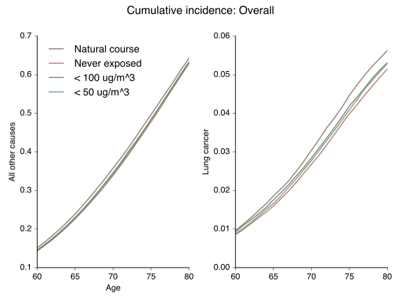

Illustrative code from the manuscript: 

Keil, Alexander P., David B. Richardson, Daniel Westreich, and Kyle Steenland. "Estimating the impact of changes to occupational standards for silica exposure on lung cancer mortality." *Epidemiology* (2018).

[See pubmed listing here](https://www.ncbi.nlm.nih.gov/pubmed/29870429/)

### ABSTRACT:
**Background:** Respiratory exposure to silica is associated with the risk of death due to malignant and non-malignant disease. 2.3 million U.S. workers are exposed to silica. Occupational exposure limits for silica are derived from a number of lines of evidence, including observational studies. Observational studies may be subject to healthy worker survivor bias, which could result in underestimates of silica’s impact on worker mortality and, in turn, bias risk estimates for occupational exposure limits.

**Methods:** Using data on 65,999 workers pooled across multiple industries, we estimate the impacts of several hypothetical occupational exposure limits on silica exposure on lung cancer and all-cause mortality. We use the parametric g-formula, which can account for healthy worker survivor bias.

**Results:** Assuming we could eliminate occupational exposure, we estimate that there would be 20.7 fewer deaths per 1,000 workers in our pooled study by age 80 (95% confidence interval: 14.5, 26.8), including 3.91 fewer deaths due to lung cancer (95%CI: 1.53, 6.30). Less restrictive interventions demonstrated smaller, but still substantial risk reductions.

**Conclusions:** Our results suggest that occupational exposure limits for silica can be further strengthened to reduce silica-associated mortality and illustrate how current risk analysis for occupational limits can be improved.

### Notes on code:
Note the following structure: 

1. The "gformula\_silica.sas" program contains code to:
    - Fit models for exposure, employment, mortality, and censoring
    - Carry out Monte Carlo algorithm to simulate pseudo-population under each hypothetical intervention/personal exposure limit
2. The "survcurves\_silica.sas" program contains code to use the pseudo-population data created in gformula\_silica.sas to estimate survival curves under each hypothetical intervention/personal exposure limit 

3. The "transformations.sas" contains code that is used both in data preparation and in the Monte Carlo simulation step of the g-formula to carry out variable transformations such as centering, creating polynomial representations of variables, creating variables representing spline bases. This code is used for convenience and to help ensure that the variables in the pseudo-population data reflect the same quantities that they do in the real data.
